# Using the Visualizer

Prev: [Part 2: Installation](2-installation.md)

PyMFCAD includes a browser-based visualizer for inspecting and validating devices. You will use it throughout the tutorial to confirm geometry, labeling, ports, and routing.

## Step 1 — Launch the visualizer

From your project directory, run:

```bash
pymfcad
```

Or, if using uv:

```bash
uv run pymfcad
```

This command starts a local web server. If the page does not open automatically, go to [http://127.0.0.1:8000/](http://127.0.0.1:8000/) in your browser. To stop the server, press Enter in the terminal where it is running.

---

## Step 2 — Load Settings dialog (first screen)

When the visualizer opens, you will see the **Load Settings** dialog. This controls what data is loaded and how the preview is prepared.

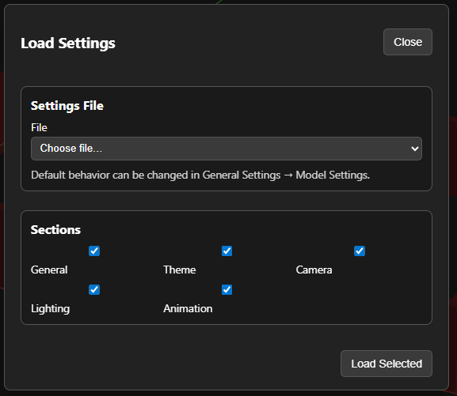

At a high level, this dialog lets you:

- Load settings from model and/or from seperate settings file
- Control what settings are loaded into the scene from each file
- **Load Selected** settings

When finish, the settings dialog can be closed with the **Close** button, or by clicking off the pane.

---

## Step 3 — General layout overview

The visualizer layout is organized around four main regions:

- **Toolbar** (bottom center) — common actions like snapshots and camera controls
- **View cube** (top right) — tool for quick orientation allowing snaping to faces, edges, or corners
- **Model selector** (top right) — visibility and category controls for models and overlays
- **Auto Reload button** (bottom right) — enables or disables auto reloading of models

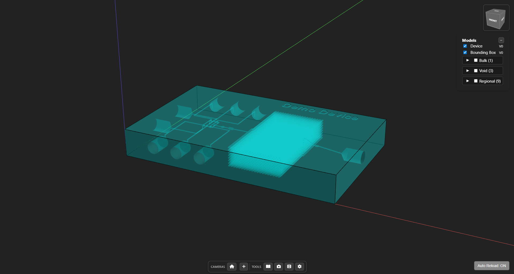

---

## Step 4 — Keyboard and mouse controls

The visualizer supports two control styles: **Orbit** and **Trackball** (selectable in Settings → Camera). Common controls:

- **F11** — toggle fullscreen in the browser.
- **Double‑click** the model — sets the camera target to the clicked surface (raycast to visible geometry).

### Orbit controls

- **Mouse**
	- Right‑click drag — orbit
	- Left‑click drag — pan
	- Scroll wheel / middle mouse — zoom
	- Hold **Shift** or **Ctrl** to swap orbit ↔ pan behavior
- **Keyboard**
	- Arrow keys — rotate
	- Arrow keys + **Shift** or **Ctrl** — pan

### Trackball controls

- **Mouse**
	- Right‑click drag — orbit
	- Left‑click drag — pan
	- Hold **A** to orbit, **S** to zoom, **D** to pan
- **Keyboard**
	- Arrow keys + **A** — orbit
	- Arrow keys + **S** — zoom (Up/Down) and roll (Left/Right)
	- Arrow keys + **D** — pan

---

## Step 5 — Model selector (overview)

The **Model Selector** controls visibility for the main geometry and overlays. Each group has a master toggle (e.g., `Device`) and may have more sub-toggles for specific content.

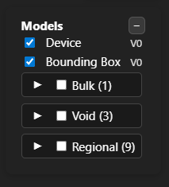

### Device

- **Device** — final bulk-minus-void geometry, used for export and slicing


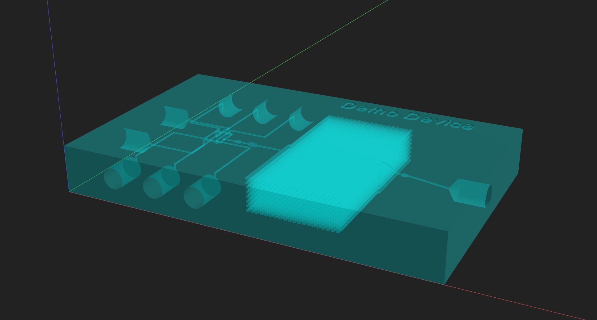

### Bounding box

- **Bounding Box** — black outline of the device bounds

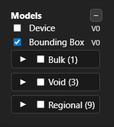

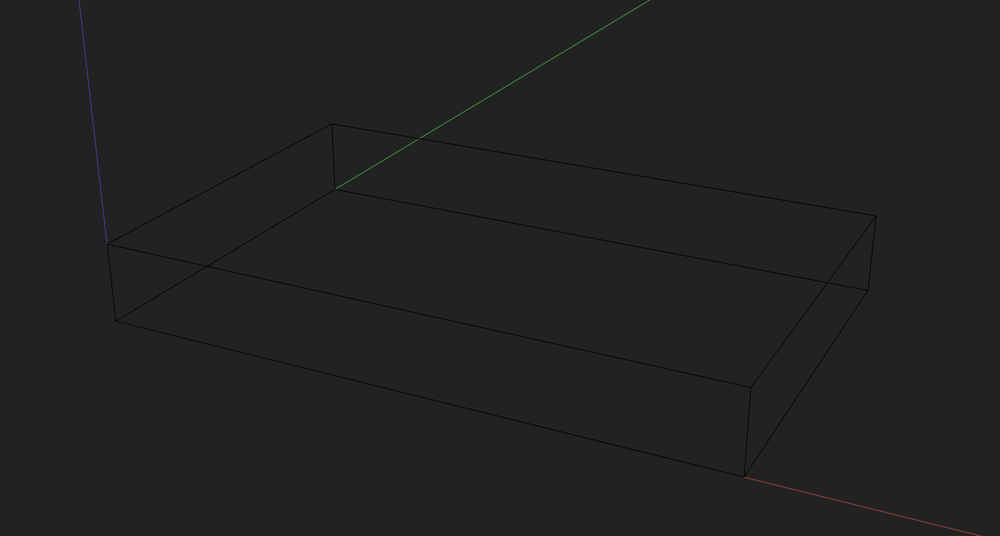

### Unconnected ports

- **Unconnected Ports** — helper overlay showing unconnected port size, position, and type (green: IN, red: OUT, blue: IN/OUT)

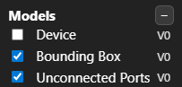

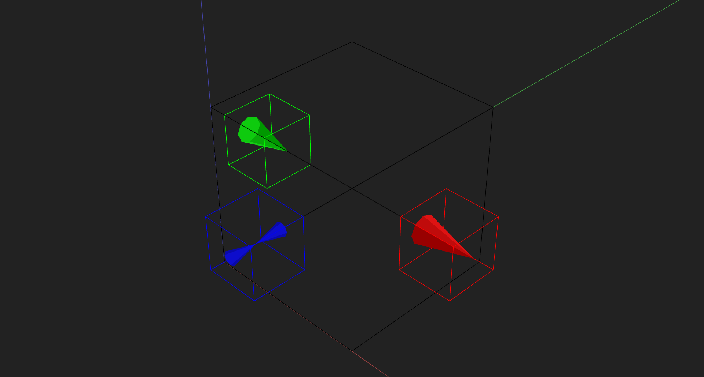

### Bulk

- **Bulk** — all bulk shapes before void subtraction

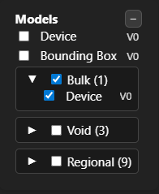

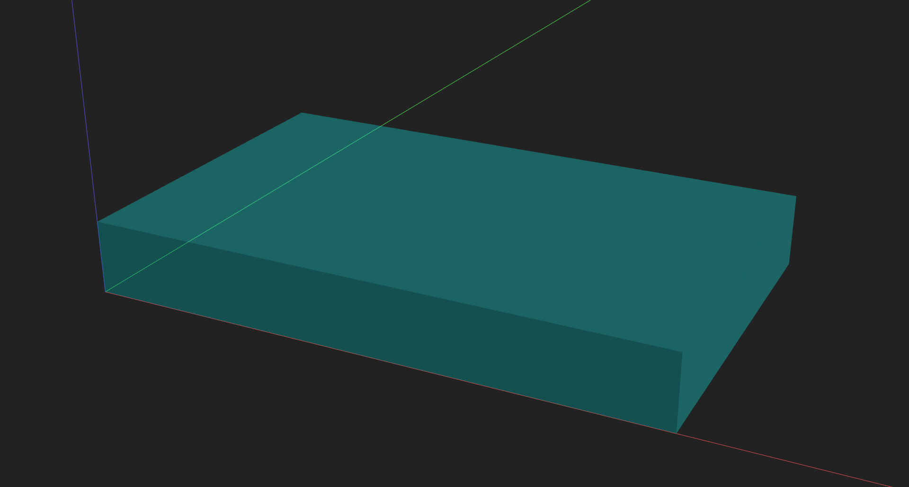

### Voids

- **Voids** — all void shapes

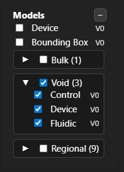

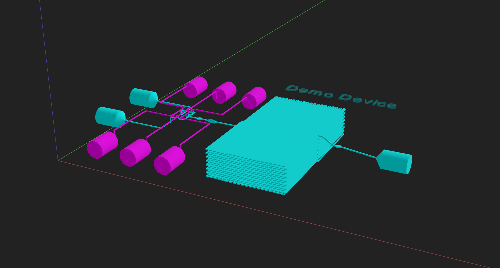

- **Fluidic Subcategory** — only voids labeled with fluidic for focused inspection


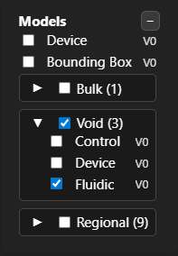

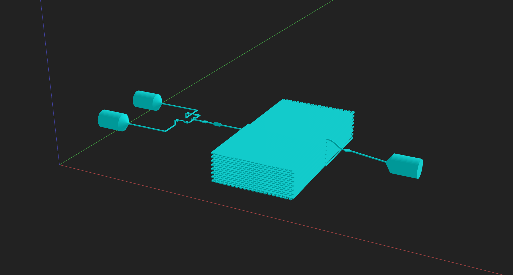

### Regional settings overlays

- **Regional** — visual overlays for regional settings (not part of final geometry)

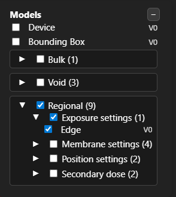

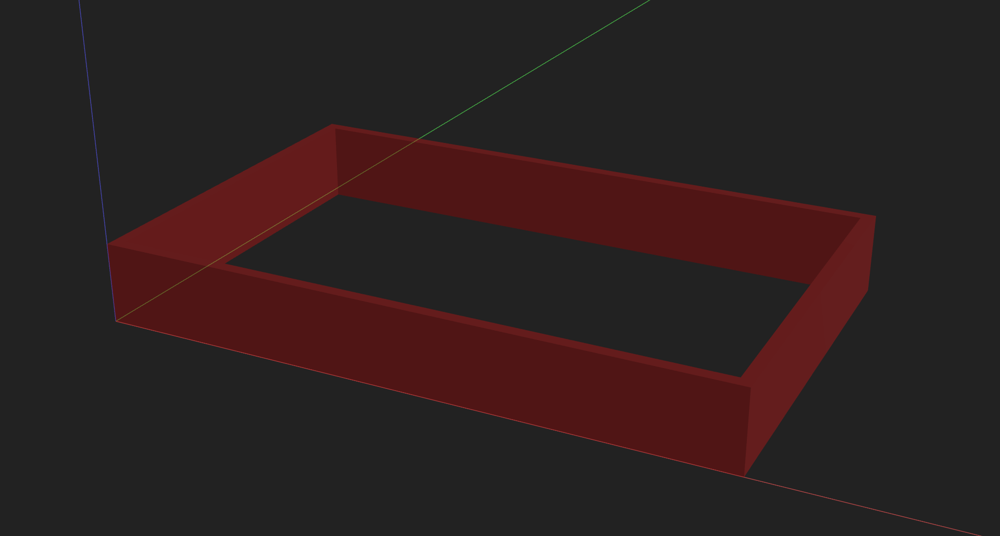

---

## Step 6 — Toolbar (overview)

The **Toolbar** is divided into two sections: **Camera Controls** and **Tools**.

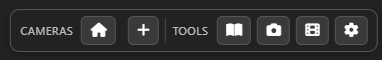

### Camera controls

- **Home** — returns the camera to the home position and clears any selected saved camera position or animation frame (advanced topic).
- **Add saved camera position** — adds a new saved position.
	When a saved position is clicked, the camera moves to that viewpoint.

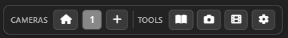

- The active saved position can be updated with the current camera view by clicking the Update Camera button.

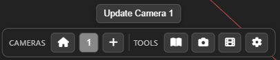

### Tools

- **Documentation** — opens the local version of this site.
- **Snapshot** — captures an image of the current view.
- **Animation** — advanced topic (covered later in [Extra 7: Advanced Visualizer Topics](e7-visualizer_advanced.md)).
- **Settings** — opens the settings panels.

---

## Step 7 — Settings panels (advanced topic)

The visualizer includes detailed settings panels for rendering and navigation. These are covered in [Extra 7: Advanced Visualizer Topics](e7-visualizer_advanced.md):

- **General settings**
- **Appearance settings**
- **Camera settings**
- **Light settings**

---

## Quick checks before moving on

- You can open the Load Settings dialog and load a preview.
- You can identify the overview, toolbar, view cube, model selector, and reload controls.
- You understand the purpose of each model selector group.

With this overview, you should be ready to begin designing your own devices.

Next: [Part 4: Creating Your First Component](4-building_first_component.md)